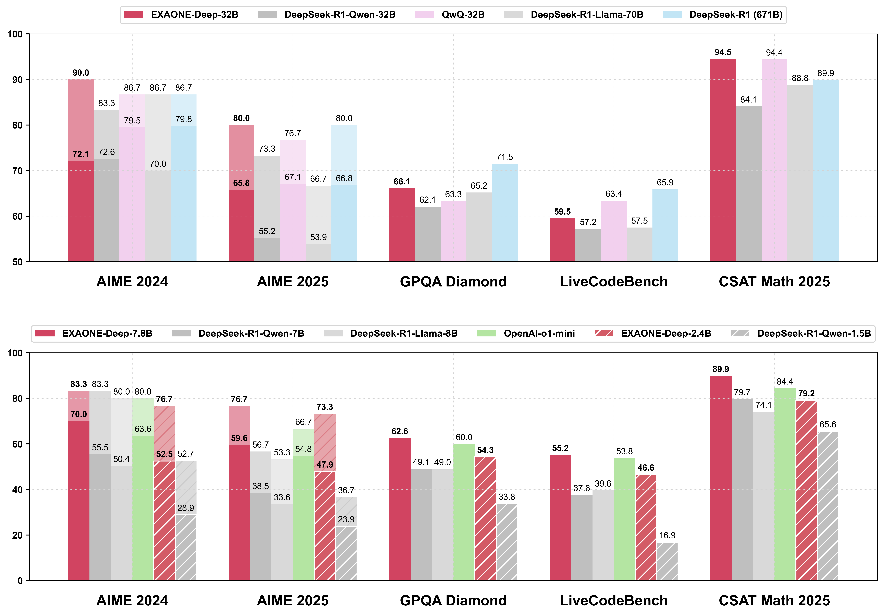
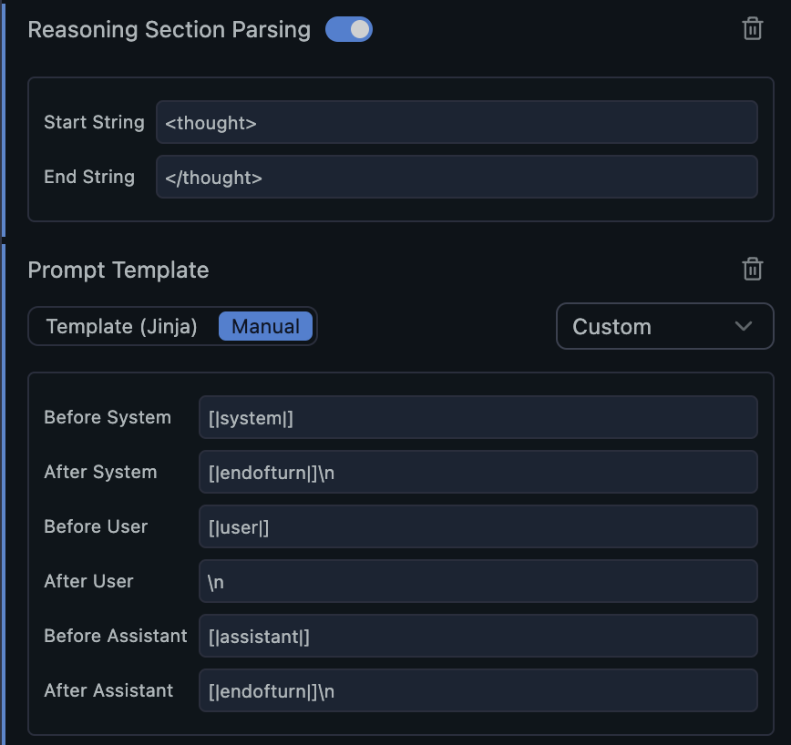

# EXAONE Deep
<br>
<p align="center">

<br>
<p align="center"> 🤗 <a href="https://huggingface.co/collections/LGAI-EXAONE/exaone-deep-67d119918816ec6efa79a4aa">Hugging Face</a> &nbsp | &nbsp 📝 <a href="https://www.lgresearch.ai/news/view?seq=543"> Blog</a> &nbsp | &nbsp 📑 <a href="https://arxiv.org/abs/2503.12524"> Documentation </a>
<br>

<br>

## Introduction

We introduce EXAONE Deep, which exhibits superior capabilities in various reasoning tasks including math and coding benchmarks, ranging from 2.4B to 32B parameters developed and released by LG AI Research. Evaluation results show that 1) EXAONE Deep 2.4B outperforms other models of comparable size, 2) EXAONE Deep 7.8B outperforms not only open-weight models of comparable scale but also a proprietary reasoning model OpenAI o1-mini, and 3) EXAONE Deep 32B demonstrates competitive performance against leading open-weight models.

<br>
<p align="center">

<br>

Our documentation consists of the following sections:

- [Performance](#performance): Experimental results of EXAONE Deep models.
- [Quickstart](#quickstart): A basic guide to using EXAONE Deep models with Transformers.
- [Quantized Models](#quantized-models): An explanation of quantized EXAONE Deep weights in `AWQ` and `GGUF` format.
- [Run Locally](#run-locally): A guide to running EXAONE Deep models locally with `llama.cpp` and `Ollama` frameworks.
- [Deployment](#deployment): A guide to running EXAONE Deep models with `TensorRT-LLM`, `vLLM`, and `SGLang` deployment frameworks.
- [Usage Guideline](#usage-guideline): A guide to utilizing EXAONE Deep models to achieve the expected performance.

<br>

## News

- 2025.03.18: We release the EXAONE Deep, reasoning enhanced language models, including 2.4B, 7.8B, and 32B. Check out the 📑 [Documentation](https://arxiv.org/abs/2503.12524)!

<br>

## Performance

Some experimental results are shown below. The full evaluation results can be found in the [Documentation](https://arxiv.org/abs/2503.12524).

<br>

<table>
    <tr>
        <th>Models</th>
        <th>MATH-500 (pass@1)</th>
        <th>AIME 2024 (pass@1 / cons@64)</th>
        <th>AIME 2025 (pass@1 / cons@64)</th>
        <th>CSAT Math 2025 (pass@1)</th>
        <th>GPQA Diamond (pass@1)</th>
        <th>Live Code Bench (pass@1)</th>
    </tr>
    <tr>
        <td>EXAONE Deep 32B</td>
        <td>95.7</td>
        <td>72.1 / <strong>90.0</strong></td>
        <td>65.8 / <strong>80.0</strong></td>
        <td><strong>94.5</strong></td>
        <td>66.1</td>
        <td>59.5</td>
    </tr>
    <tr>
        <td>DeepSeek-R1-Distill-Qwen-32B</td>
        <td>94.3</td>
        <td>72.6 / 83.3</td>
        <td>55.2 / 73.3</td>
        <td>84.1</td>
        <td>62.1</td>
        <td>57.2</td>
    </tr>
    <tr>
        <td>QwQ-32B</td>
        <td>95.5</td>
        <td><strong>79.5</strong> / 86.7</td>
        <td><strong>67.1</strong> / 76.7</td>
        <td>94.4</td>
        <td>63.3</td>
        <td>63.4</td>
    </tr>
    <tr>
        <td>DeepSeek-R1-Distill-Llama-70B</td>
        <td>94.5</td>
        <td>70.0 / 86.7</td>
        <td>53.9 / 66.7</td>
        <td>88.8</td>
        <td>65.2</td>
        <td>57.5</td>
    </tr>
    <tr>
        <td>DeepSeek-R1 (671B)</td>
        <td><strong>97.3</strong></td>
        <td>79.8 / 86.7</td>
        <td>66.8 / <strong>80.0</strong></td>
        <td>89.9</td>
        <td><strong>71.5</strong></td>
        <td><strong>65.9</strong></td>
    </tr>
    <tr>
        <th colspan="7" height="30px"></th>
    </tr>
    <tr>
        <td>EXAONE Deep 7.8B</td>
        <td><strong>94.8</strong></td>
        <td><strong>70.0</strong> / <strong>83.3</strong></td>
        <td><strong>59.6</strong> / <strong>76.7</strong></td>
        <td><strong>89.9</strong></td>
        <td><strong>62.6</strong></td>
        <td><strong>55.2</strong></td>
    </tr>
    <tr>
        <td>DeepSeek-R1-Distill-Qwen-7B</td>
        <td>92.8</td>
        <td>55.5 / <strong>83.3</strong></td>
        <td>38.5 / 56.7</td>
        <td>79.7</td>
        <td>49.1</td>
        <td>37.6</td>
    </tr>
    <tr>
        <td>DeepSeek-R1-Distill-Llama-8B</td>
        <td>89.1</td>
        <td>50.4 / 80.0</td>
        <td>33.6 / 53.3</td>
        <td>74.1</td>
        <td>49.0</td>
        <td>39.6</td>
    </tr>
    <tr>
        <td>OpenAI o1-mini</td>
        <td>90.0</td>
        <td>63.6 / 80.0</td>
        <td>54.8 / 66.7</td>
        <td>84.4</td>
        <td>60.0</td>
        <td>53.8</td>
    </tr>
    <tr>
        <th colspan="7" height="30px"></th>
    </tr>
    <tr>
        <td>EXAONE Deep 2.4B</td>
        <td><strong>92.3</strong></td>
        <td><strong>52.5</strong> / <strong>76.7</strong></td>
        <td><strong>47.9</strong> / <strong>73.3</strong></td>
        <td><strong>79.2</strong></td>
        <td><strong>54.3</strong></td>
        <td><strong>46.6</strong></td>
    </tr>
    <tr>
        <td>DeepSeek-R1-Distill-Qwen-1.5B</td>
        <td>83.9</td>
        <td>28.9 / 52.7</td>
        <td>23.9 / 36.7</td>
        <td>65.6</td>
        <td>33.8</td>
        <td>16.9</td>
    </tr>
</table>

<br>

## Quickstart

- You need to install `transformers>=4.43.1` for the EXAONE Deep models. The latest version is recommended to use.

Here is the example code to show how to use EXAONE Deep models.

> [!Tip]
> In all the examples below, you can use another size model by changing 7.8B to 32B or 2.4B.

```python
import torch
from transformers import AutoModelForCausalLM, AutoTokenizer, TextIteratorStreamer
from threading import Thread

model_name = "LGAI-EXAONE/EXAONE-Deep-7.8B"
streaming = True    # choose the streaming option

model = AutoModelForCausalLM.from_pretrained(
    model_name,
    torch_dtype=torch.bfloat16,
    trust_remote_code=True,
    device_map="auto"
)
tokenizer = AutoTokenizer.from_pretrained(model_name)

messages = [
    {"role": "user", "content": "How many golf balls can fit in a school bus?"}
]
input_ids = tokenizer.apply_chat_template(
    messages,
    tokenize=True,
    add_generation_prompt=True,
    return_tensors="pt"
)

if streaming:
    streamer = TextIteratorStreamer(tokenizer)
    thread = Thread(target=model.generate, kwargs=dict(
        input_ids=input_ids.to("cuda"),
        eos_token_id=tokenizer.eos_token_id,
        max_new_tokens=32768,
        do_sample=True,
        temperature=0.6,
        top_p=0.95,
        streamer=streamer
    ))
    thread.start()

    for text in streamer:
        print(text, end="", flush=True)
else:
    output = model.generate(
        input_ids.to("cuda"),
        eos_token_id=tokenizer.eos_token_id,
        max_new_tokens=32768,
        do_sample=True,
        temperature=0.6,
        top_p=0.95,
    )
    print(tokenizer.decode(output[0]))
```

> [!Important]
> The EXAONE Deep models are trained with an optimized configuration,
> so we recommend following the [Usage Guideline](#usage-guideline) section to achieve optimal performance.

<br>

## Quantized Models

We introduce a series of quantized weights of EXAONE Deep models.

### AWQ

We provide AWQ-quantized weights of EXAONE Deep models, quantized using `AutoAWQ` library. Please refer to the [EXAONE Deep collection](https://huggingface.co/collections/LGAI-EXAONE/exaone-deep-67d119918816ec6efa79a4aa) for pre-quantized weights, and the [AutoAWQ documentation](https://github.com/casper-hansen/AutoAWQ) for more details.

You need to install the latest version of AutoAWQ library (`autoawq>=0.2.8`) to load the AWQ-quantized version of EXAONE Deep models.

```bash
pip install autoawq
```

You can load the model in similar ways to the original models, only changing the model name. It automatically loads with AWQ configuration of the model. Please check the [Quickstart section](#quickstart) above for more details.

### GGUF

We provide weights in `BF16` format and quantized weights in `Q8_0`, `Q6_K`, `Q5_K_M`, `Q4_K_M`, `IQ4_XS`. 

The example below is for the 7.8B model in BF16 format. Please refer to the [EXAONE Deep collection](https://huggingface.co/collections/LGAI-EXAONE/exaone-deep-67d119918816ec6efa79a4aa) to find quantized models. You may need to install `huggingface_hub` to download the GGUF weights.

```bash
# (optional) install huggingface_hub
pip install huggingface_hub

# Download the GGUF weights
huggingface-cli download LGAI-EXAONE/EXAONE-Deep-7.8B-GGUF \
    --include "EXAONE-Deep-7.8B-BF16*.gguf" \
    --local-dir .
```

## Run Locally

For end users, we introduce two ways to run EXAONE Deep models locally. 

> [!Note]
> We highly recommend to use repetition penalty not exceeding 1.0 for better generation quality.

### llama.cpp

You can run EXAONE models with llama.cpp as follows:

1. Install llama.cpp. Please refer to the [llama.cpp repository](https://github.com/ggerganov/llama.cpp) for more details.

2. Download EXAONE Deep model in GGUF format.

```bash
huggingface-cli download LGAI-EXAONE/EXAONE-Deep-7.8B-GGUF \
    --include "EXAONE-Deep-7.8B-BF16*.gguf" \
    --local-dir .
```

3. Run the model with llama.cpp in conversational mode. We set chat-template explicitly to handle reasoning steps properly. 

```bash
llama-cli -m ./EXAONE-Deep-7.8B-BF16.gguf \
    -sys "" \
    -c 32768 \
    --temp 0.6 \
    --top-p 0.95 \
    --jinja \
    --chat-template "{{ '[|system|][|endofturn|]\n' }}{{ '[|' + message['role'] + '|]' + content }}{{ '[|endofturn|]' }}{{ '\n' }}{{ '\n[|assistant|]<thought>\n' }}"
```

- In case of using EXAONE Deep 32B model with BF16 precision, you may need to download all split files and merge them before running the model.

    ```bash
    # Download all split files
    huggingface-cli download LGAI-EXAONE/EXAONE-Deep-32B-GGUF \
        --include "EXAONE-Deep-32B-BF16*.gguf" \
        --local-dir .

    # Merge all split files
    llama-gguf-split --merge \
        ./EXAONE-Deep-32B-BF16-00001-of-00002.gguf \
        ./EXAONE-Deep-32B-BF16.gguf
    ```

### Ollama

You can create and run EXAONE Deep models with GGUF format for customizing.

1. Install Ollama. Please refer to the [Ollama repository](https://github.com/ollama/ollama) for more details.

2. Download EXAONE Deep model in GGUF format. Please refer to the [GGUF section](#gguf) for more details.

3. Write the `Modelfile` for EXAONE Deep.

```text
# Model path (choose appropriate GGUF weights on your own)
FROM ./EXAONE-Deep-7.8B-BF16.gguf

# Parameter values
PARAMETER stop "[|endofturn|]"
PARAMETER repeat_penalty 1.0
PARAMETER num_ctx 32768
PARAMETER temperature 0.6
PARAMETER top_p 0.95

# Chat template
#   Note: currently there is no feature of removing `<thought></thought>` steps from context 
#   because ollama does not support yet. We will update when according feature is available.
TEMPLATE """{{- range $i, $_ := .Messages }}
{{- $last := eq (len (slice $.Messages $i)) 1 -}}
{{ if eq .Role "system" }}[|system|]{{ .Content }}[|endofturn|]
{{ continue }}
{{ else if eq .Role "user" }}[|user|]{{ .Content }}
{{ else if eq .Role "assistant" }}[|assistant|]{{ .Content }}[|endofturn|]
{{ end }}
{{- if and (ne .Role "assistant") $last }}[|assistant|]<thought>
{{ end }}
{{- end -}}"""

# System prompt
SYSTEM """"""

# License
LICENSE """EXAONE AI Model License Agreement 1.1 - NC """
```

4. Convert the model to Ollama.
```bash
ollama create exaone -f Modelfile
```

3. Run the model with Ollama.
```bash
ollama run exaone
```

### LM-Studio

You can run EXAONE Deep models on your device with LM-Studio.

1. Install LM-Studio. Please refer to the [LM-Studio Page](https://lmstudio.ai/) for more details.

2. Download EXAONE Deep model in GGUF format. You can search and find proper model at `Model Search`.

3. Configure the prompt setting. 
    - Set **"Reasoning Section Parsing"** as `<thought>` and `</thought>`
    - Set **"Template (Jinja)"** as that of EXAONE 3.5.
        ```
        {{ '[|system|][|endofturn|]\n' }}{{ '[|' + message['role'] + '|]' + message['content'] }}{{ '\n' }}{{ '[|endofturn|]\n' }}{{ '[|assistant|]' }}
        ```

Or, you can use custom prompt as below.
<p>


## Deployment

EXAONE Deep models have been integrated into various deployment frameworks. 

> [!Important]
> Before your deployment of EXAONE Deep models, we recommend following the [Usage Guideline](#usage-guideline) section to achieve the expected performance. 

### TensorRT-LLM

TensorRT-LLM has supported EXAONE language models since EXAONE 3.0. We recommend using TensorRT-LLM for the best performance. You can run EXAONE Deep models with TensorRT-LLM by following the instructions on [TensorRT-LLM EXAONE Example](https://github.com/NVIDIA/TensorRT-LLM/tree/main/examples/exaone).

> [!Note]
> When you convert EXAONE Deep models to TensorRT-LLM format, you may need to set the environment variable `TRTLLM_DISABLE_UNIFIED_CONVERTER=1`.

> [!Note]
> TensorRT-LLM also supports AWQ on their own methods.
> If you want to use AWQ with TensorRT-LLM, please refer to the [AWQ section](https://github.com/NVIDIA/TensorRT-LLM/tree/main/examples/exaone#groupwise-quantization-awq) in TensorRT-LLM EXAONE Example.

### vLLM

You can easily run EXAONE Deep models with vLLM. 

1. Install vLLM (`vllm>=0.6.0`). Please refer to the [vLLM quickstart guide](https://docs.vllm.ai/en/latest/getting_started/quickstart.html) for more details.

```bash
pip install vllm
```

2. Run the models with vLLM.

```bash
vllm serve LGAI-EXAONE/EXAONE-Deep-7.8B
```

3. Send a request with the following curl command after the server starts.

```bash
curl -X POST http://localhost:8000/v1/chat/completions \
    -H "Content-Type: application/json" \
    -d '{
        "model": "LGAI-EXAONE/EXAONE-Deep-7.8B",
        "messages": [
            {"role": "user", "content": "How many golf balls can fit in a school bus?"}
        ],
        "max_tokens": 30720,
        "temperature": 0.6,
        "top_p": 0.95
    }'
```

> [!Note]
> If you want to serve GGUF quantized models with vLLM, please refer to the [vLLM GGUF documentation](https://docs.vllm.ai/en/latest/quantization/gguf.html).

### SGLang

You can also run EXAONE Deep models with SGLang.

1. Install SGLang. Please refer to the [SGLang documentation](https://sgl-project.github.io) for more details.

2. Run the server with the following command.

```bash
python -m sglang.launch_server --model-path LGAI-EXAONE/EXAONE-Deep-7.8B \
    --port 30000 --host 0.0.0.0
```

> [!Note]
> In case of using EXAONE Deep 2.4B model, you need to install sglang>=0.3.6 and use `--attention-backend triton` option.
>
> Additionally, we are currently working on a PR to fix the incompatibility of flashinfer with EXAONE Deep 2.4B. 
> Please refer to the [PR](https://github.com/sgl-project/sglang/pull/4064) for details.

3. Send a request with the following curl command after the server starts.

```bash
curl -s http://0.0.0.0:30000/v1/chat/completions \
    -d '{
        "model": "LGAI-EXAONE/EXAONE-Deep-7.8B",
        "messages": [
            {"role": "user", "content": "How many golf balls can fit in a school bus?"}
        ],
        "max_tokens": 30720,
        "temperature": 0.6,
        "top_p": 0.95,
    }'
```

<br>

## Usage Guideline

To achieve the expected performance, we recommend using the following configurations:

1. Ensure the model starts with `<thought>\n` for reasoning steps. The model's output quality may be degraded when you omit it. You can easily apply this feature by using `tokenizer.apply_chat_template()` with `add_generation_prompt=True`. Please check the example code on [Quickstart](#quickstart) section.
2. The reasoning steps of EXAONE Deep models enclosed by `<thought>\n...\n</thought>` usually have lots of tokens, so previous reasoning steps may be necessary to be removed in multi-turn situation. The provided tokenizer handles this automatically.
3. Avoid using system prompt, and build the instruction on the user prompt. 
4. Additional instructions help the models reason more deeply, so that the models generate better output.
    - For math problems, the instructions **"Please reason step by step, and put your final answer within \boxed{}."** are helpful.
    - For more information on our evaluation setting including prompts, please refer to our [Documentation](https://arxiv.org/abs/2503.12524).
5. In our evaluation, we use `temperature=0.6` and `top_p=0.95` for generation. 
6. When evaluating the models, it is recommended to test multiple times to assess the expected performance accurately.

<br>

## Limitation

The EXAONE language model has certain limitations and may occasionally generate inappropriate responses. The language model generates responses based on the output probability of tokens, and it is determined during learning from training data. While we have made every effort to exclude personal, harmful, and biased information from the training data, some problematic content may still be included, potentially leading to undesirable responses. Please note that the text generated by EXAONE language model does not reflects the views of LG AI Research.

- Inappropriate answers may be generated, which contain personal, harmful or other inappropriate information.
- Biased responses may be generated, which are associated with age, gender, race, and so on.
- The generated responses rely heavily on statistics from the training data, which can result in the generation of
semantically or syntactically incorrect sentences.
- Since the model does not reflect the latest information, the responses may be false or contradictory.

LG AI Research strives to reduce potential risks that may arise from EXAONE language models. Users are not allowed
to engage in any malicious activities (e.g., keying in illegal information) that may induce the creation of inappropriate
outputs violating LG AI's ethical principles when using EXAONE language models.

<br>

## License

The model is licensed under [EXAONE AI Model License Agreement 1.1 - NC](./LICENSE)
 
<br>
 
## Citation
 
```
@article{exaone-deep,
  title={EXAONE Deep: Reasoning Enhanced Language Models},
  author={{LG AI Research}},
  journal={arXiv preprint arXiv:2503.12524},
  year={2025}
}
```

<br>

## Contact
LG AI Research Technical Support: contact_us@lgresearch.ai
